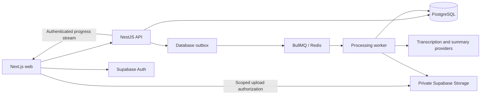

# Archy Rebuild — Design Brief

Status: initial skeleton authorized on 2026-10-07; later milestones remain planned.
Date: 2026-10-06, Asia/Seoul.

## Layout correction — 2026-10-07

The active project layout is defined in [the separated-project design](2026-10-07-archy-separated-projects-design.md). Backend root is `/Users/user/Desktop/archy`; frontend root is `/Users/user/Desktop/archy-next`. Each owns its dependencies and tooling. Product, authorization and durable-processing contracts below remain in effect.

## Intent

Build Archy as a real AI lecture assistant with clear frontend/backend boundaries, reliable recording and processing, and maintainable operations. The owner is Xushnudbek76. Start with a runnable local skeleton and add complete product workflows in milestones.

The existing `/Users/user/Desktop/Archy_V2`, `/Users/user/Desktop/insu-web`, and `/Users/user/Desktop/insurance-ai` repositories are reference material. This project is not a migration of their users, production databases, deployments, or secrets. Reuse only code and assets the developer owns or has permission to use, and document contributions.

## Product Scope

### Product MVP

1. Read-only guest demonstration with clearly labeled sample data.
2. Email/password signup, login, session renewal, and logout through Supabase Auth.
3. Personal courses: create, list, rename, and archive.
4. Upload a short audio file; later add microphone recording to the same ingestion contract.
5. Durable transcription and summary generation with progress states.
6. View and search completed transcripts and notes; bookmark notes.
7. An administrator can inspect sanitized failed-job details and request a controlled retry.
8. Responsive English and Korean core UI.
9. A reproducible development environment, automated checks, and a deployed product with verified operational behavior.

### Later Features

Live transcription and summaries, translation, timetable OCR/import, shared classes, notifications, community, subscriptions/payments, and native mobile clients are separate follow-up projects. No production-parity claim is made for the MVP.

## Architecture

Use a modular NestJS backend with a separately deployed worker and a Next.js frontend. API and worker share backend domain code; the browser imports only public contracts and its generated client. PostgreSQL stores authoritative application state. Redis/BullMQ delivers jobs; Redis is not the authoritative owner of recording completion or billing state.

Next.js server routes may bridge the web session to the API but must not duplicate NestJS business rules. NestJS owns authorization, application writes, recording admission, upload acceptance, job state, and administrator actions. Storage upload authorization is scoped to an owned recording and expires; upload completion is validated by the API before processing.

## Technology Decisions

| Concern               | Decision                                                                   |
| --------------------- | -------------------------------------------------------------------------- |
| Runtime               | Node.js 24 LTS; pin a concrete supported patch at implementation           |
| Projects              | Independent NestJS backend and Next.js frontend, each with an npm lockfile |
| Web                   | Next.js App Router, React, strict TypeScript, Tailwind                     |
| API                   | NestJS, REST under `/v1`, OpenAPI-generated TypeScript client              |
| Validation            | NestJS DTO validation at API boundaries; no second conflicting API schema  |
| Database              | PostgreSQL; Prisma client and Prisma-owned application migrations          |
| Identity/files        | Supabase Auth and private Supabase Storage                                 |
| Background processing | BullMQ and Redis, PostgreSQL outbox and idempotent writes                  |
| Client state          | React state; Zustand only for recorder/session UI requiring shared state   |
| Updates               | SSE for persisted processing progress; reconnect loads authoritative state |
| Tests                 | Jest, Supertest, real PostgreSQL/Redis integration tests, Playwright       |
| Operations            | Docker, GitHub Actions, structured logs, Sentry                            |

Resolve mutually compatible supported stable package releases when scaffolding and pin them in the lockfile. Record versions and choices in `docs/decisions/0001-stack.md`. Do not combine Prisma application migrations with another application-schema migration owner. Supabase manages its own Auth/Storage schemas.

## Global Constraints

- Independent project root: `/Users/user/Desktop/archy`.
- Runtime: Node.js 24 LTS; TypeScript strict mode in all applications.
- Public API prefix: `/v1`; Next.js contains no duplicate domain write rules.
- Application schema: `app`; Prisma is its sole migration owner; Supabase Auth/Storage schemas are external.
- Roles: `USER` and `ADMIN`; application role comes from PostgreSQL, never user-editable auth metadata.
- Resource ownership: every private read and write checks the authenticated owner; foreign-owned resources return 404.
- Demo mode: anonymous, read-only, sample data labeled; it cannot enqueue AI work or write private data.
- MVP audio limit: 20 MiB and 10 minutes; accepted verified containers: WAV, MP3, MP4/M4A, WebM.
- Languages: English and Korean core UI; no requirement to translate the entire original Archy product.
- Production databases, credentials, and existing repository code are not changed during this rebuild.

## Identity and Database Access

The API verifies Supabase access tokens: signature, configured issuer, audience, expiry, and subject. Production uses the configured project's asymmetric signing keys/JWKS. Automated tests use a separate signed-token fixture with a local JWKS endpoint; no production bypass exists.

`User.id` equals the verified auth subject UUID. Only safe profile fields are synchronized on first authenticated access. `User.role` defaults to USER; administrators are provisioned through a documented restricted operation. A valid token alone does not make an administrator.

Application data is not exposed through the Supabase Data API. NestJS repositories enforce ownership when accessing the `app` schema through Prisma. Use separate runtime and migration database credentials. Runtime credentials cannot migrate the schema. If application tables are exposed through a Data API later, add and verify explicit RLS policies before exposing them.

The web uses the official Supabase SSR session mechanism; do not invent a second access-token store in localStorage. Cookie-authenticated mutations must validate their origin/CSRF boundary. Session handling and API transport are separate from application rules.

## Data Model

| Entity        | Main fields / invariants                                                                     |
| ------------- | -------------------------------------------------------------------------------------------- |
| User          | id UUID, email nullable, displayName nullable, role USER/ADMIN, createdAt                    |
| Course        | id UUID, ownerId, title, archivedAt nullable, createdAt, updatedAt                           |
| Recording     | id UUID, ownerId, courseId, title, storageKey, status, processingVersion, deletedAt nullable |
| Upload        | id UUID, recordingId, ownerId, idempotencyKey, accepted object checksum/size/duration        |
| ProcessingRun | id UUID, recordingId, version, stage, lease/fencing identity, timestamps, safe error code    |
| Transcript    | recordingId/version unique, language, text, provider metadata                                |
| Note          | recordingId/version unique, summary, body, model/prompt version                              |
| Bookmark      | ownerId/noteId unique                                                                        |
| OutboxEvent   | id UUID, event type, payload, dispatchedAt, retry metadata                                   |
| AuditEvent    | actorId, action, targetId, timestamp; no raw audio or full transcript in logs                |

Course archive keeps existing recordings readable. Recording deletion immediately hides the resource and prevents late writes; object cleanup is asynchronous and retried. A run references a specific processing version, so obsolete workers cannot overwrite a new run.

## Processing Contract

1. API authorizes an owned recording and issues bounded upload authorization.
2. Upload acceptance verifies storage metadata, actual media format, checksum, duration, size, and ownership.
3. The API transaction creates the processing run and outbox event together.
4. A dispatcher publishes the outbox event using a stable BullMQ job ID without colon characters. Publishing again must be harmless.
5. Workers claim/version-check the run, load audio, transcribe, summarize, and persist each accepted stage.
6. Outputs use unique run/version constraints and guarded writes. Retried execution cannot duplicate notes or completion side effects.
7. PostgreSQL remains authoritative after job removal, Redis loss, duplicate delivery, or worker restart; reconciliation republishes unfinished work when safe.
8. Persisted progress has a monotonically increasing revision. SSE is a notification mechanism; reconnect fetches the current resource and does not depend on every event having been received.

Retry transient network/rate-limit/provider failures at most three automatic attempts with backoff and jitter. Permanent invalid-media errors fail without retry. A provider timeout after an external request may leave an uncertain cost; prevent duplicate persisted results without promising exactly-once provider billing. Manual retry is audited and increments the processing version.

## Development and Delivery

Use Docker Compose for local PostgreSQL and Redis. Use a dedicated non-production Supabase Auth/Storage project; credentials are supplied through documented environment variables. Production application data can use a separate PostgreSQL/Supabase database in the same deployment region as API/worker. Test databases and real-provider smoke tests are isolated.

Deploy web, API, and worker separately. A container host supports the API's SSE connections and the worker's media tools. Select a host after checking the available budget; provision nothing while planning. CI requires typecheck, lint, tests, builds, migration-from-empty checks, and generated-client drift checks. Secrets remain in environment/CI secret storage.

## Product Acceptance

- A visitor can see a labeled example without signup and complete a real authenticated upload flow with a short sample.
- Ownership isolation, repeated upload acceptance, worker restart, provider failure, Redis outage/recovery, and deletion during processing have automated evidence.
- The developer can explain controller/service/repository boundaries, schema constraints, indexes, retry behavior, and the outbox tradeoff.
- README links to demo, short video, architecture diagram, API docs, and test instructions.
- Documentation reports measured conditions and results, contributions, limitations, and third-party attribution.

## References

- [Node.js release policy](https://nodejs.org/en/about/previous-releases)
- [NestJS modules](https://docs.nestjs.com/modules)
- [NestJS OpenAPI](https://docs.nestjs.com/openapi/introduction)
- [NestJS queues](https://docs.nestjs.com/techniques/queues)
- [Supabase JWT verification](https://supabase.com/docs/guides/auth/jwts)
- [Supabase Storage](https://supabase.com/docs/guides/storage)
- [Prisma PostgreSQL](https://www.prisma.io/docs/orm/overview/databases/postgresql)
- [BullMQ job IDs](https://docs.bullmq.io/guide/jobs/job-ids)
